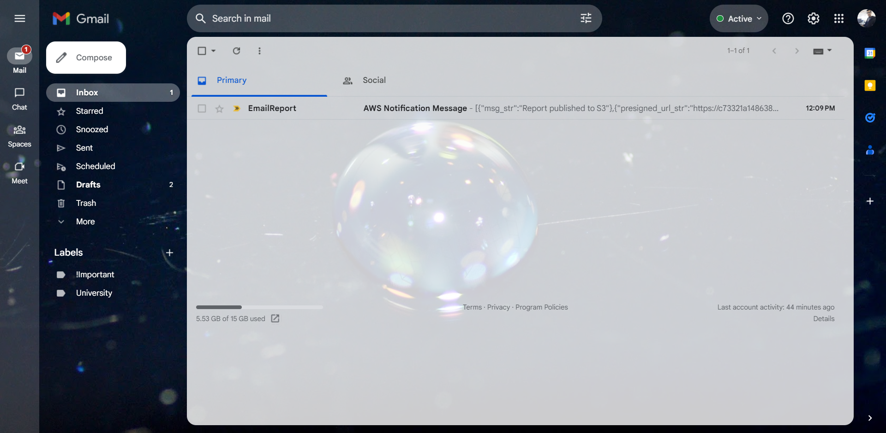

# Orchestrating Serverless Functions with Step Functions

## Start Architecture

---
## Final Architecture

---
## Lab Tasks

* Create an asynchronous state machine by using Step Functions
* Configure an Amazon Simple Notification Service (Amazon SNS) topic to deliver email alerts
* Configure AWS Lambda functions to be invoked from a Step Functions state machine
* Use a parallel state flow object in the design of a Step Functions state machine
* Invoke a state machine to start when a REST API endpoint is invoked
* Generate a presigned URL for an object stored in an Amazon Simple Storage Service (Amazon S3) bucket
---
## State Machine:

---
## SNS Notifications on my Email:

---
## Pre-signed url Preview:

